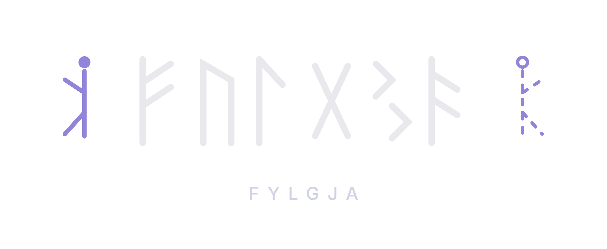

  

Project Fylga is an effort to bring affordable motion capture technology to the VR gaming world, with the aid of IoT sensors, low latency links, and Machine Learning algorithms for interprotation
